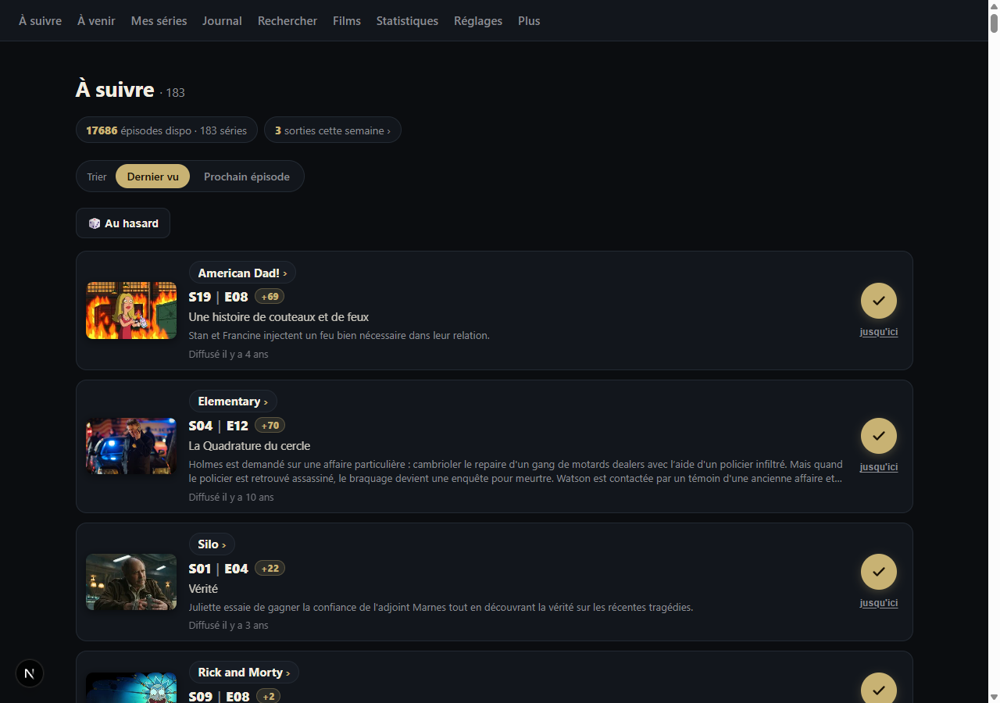
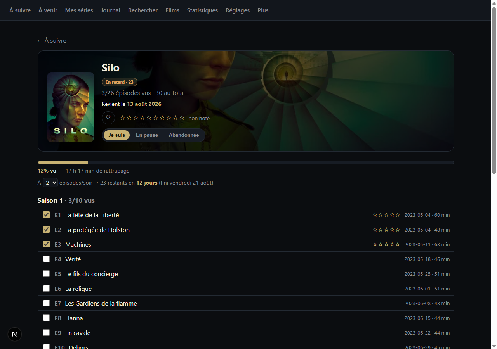
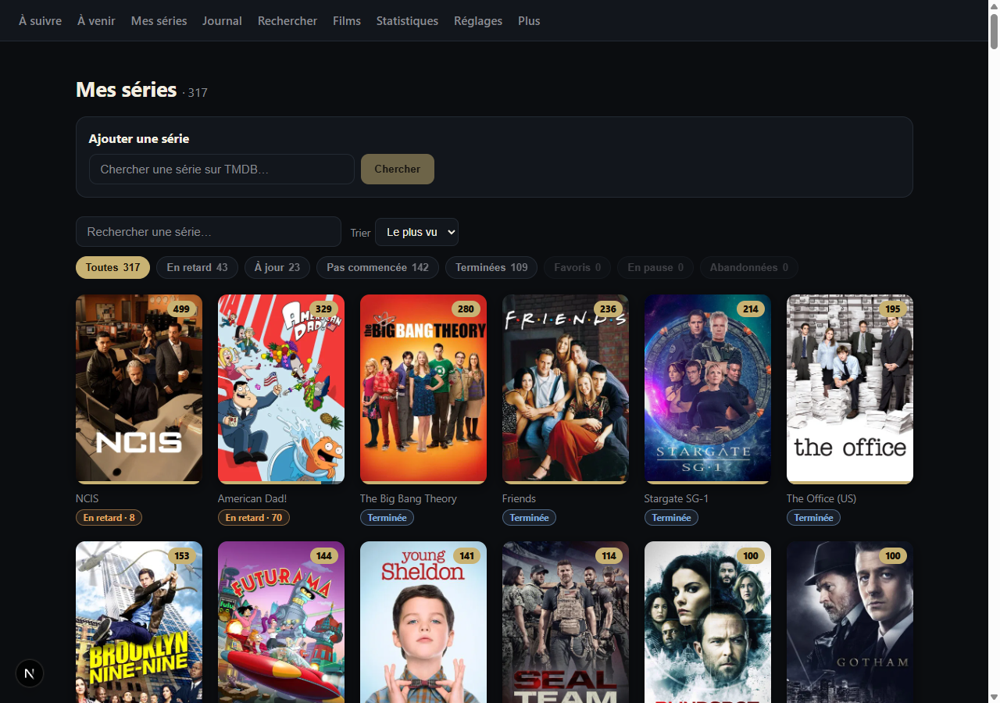
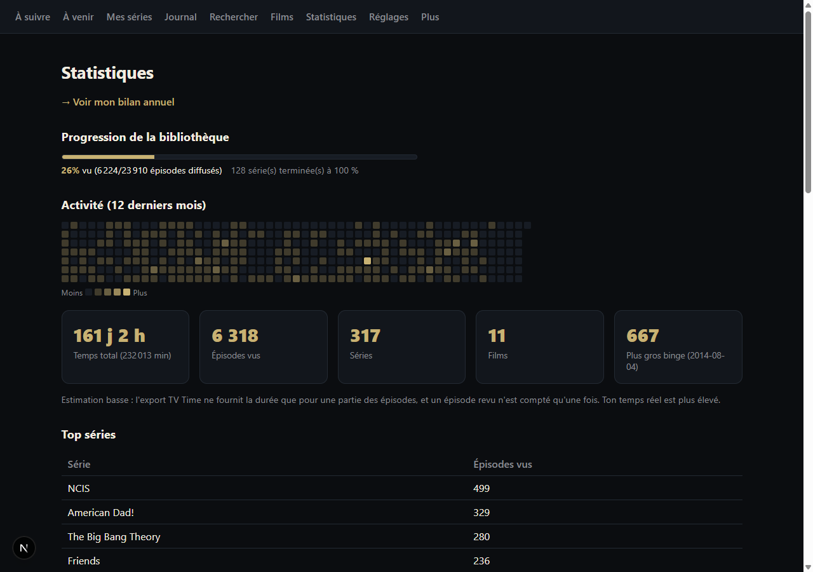
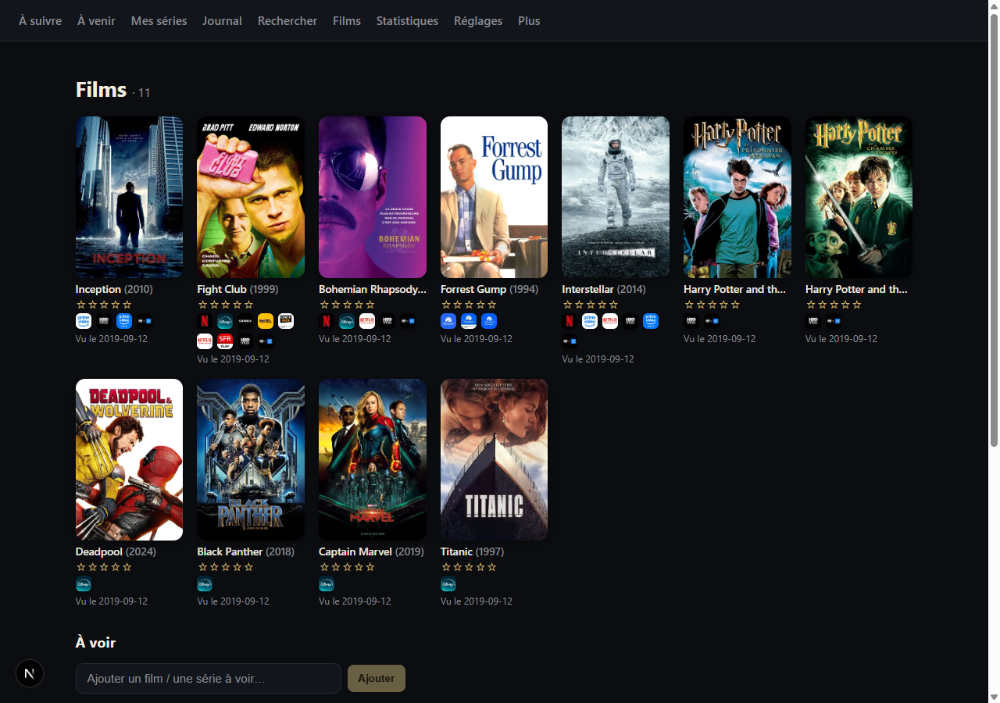

<div align="center">


# Cathode

**Un suivi de séries et de films auto-hébergé.**
Sachez quoi regarder ensuite, cochez vos épisodes, et gardez votre historique chez vous.

[](https://github.com/PierreTzt/cathode/actions/workflows/ci.yml)
[](LICENSE)


[English version](README.md)

</div>

Cathode a été construit pour remplacer TV Time après la fermeture du service.
Il importe un export GDPR TV Time si vous en avez conservé un, et fonctionne
très bien sans.

<div align="center">
  
</div>

## Ce que ça fait

**Suivre ses épisodes.** Chaque série suivie affiche son prochain épisode non
vu, avec son synopsis et son image. Cochez-le, ou utilisez **« jusqu'ici »**
pour rattraper plusieurs épisodes d'un coup. Triez par dernier vu ou par
prochain épisode — ou appuyez sur le dé quand vous n'arrivez pas à choisir.

**Savoir où vous en êtes.** La fiche d'une série donne la liste complète des
épisodes saison par saison, ce qu'il reste à voir, et le temps réel de
rattrapage. Donnez-lui un rythme — deux épisodes par soir — et elle vous dit la
date à laquelle vous aurez fini.

**Tenir une bibliothèque.** Filtrez vos séries par en retard, à jour, pas
commencée, terminée, favorite, en pause ou abandonnée. Notez-les, marquez vos
favorites, et consultez le casting, les plateformes de streaming et les séries
similaires récupérés depuis TMDB.

**Voir les chiffres.** Progression de la bibliothèque, carte d'activité sur
douze mois, temps total passé devant l'écran, votre plus gros jour de binge, top
séries, et un bilan annuel.

**Les films aussi.** Films vus avec notes et plateformes, plus une liste
« à voir » avec un bouton **« j'ai vu »**.

**Et le reste.** Un calendrier des prochaines diffusions, un journal de
visionnage, la recherche TMDB pour ajouter des séries, le statut de
renouvellement (« revient le… » / « annulée »), un thème clair et un thème
sombre, une synchronisation Jellyfin optionnelle, des sauvegardes automatiques
avec rotation, et une sauvegarde/restauration en un clic.

L'appli s'installe comme une PWA et peut envoyer des notifications push pour les
nouveaux épisodes ainsi qu'un récapitulatif le dimanche.

<table>
<tr>
<td width="50%"><br/><sub><b>Fiche série</b> — suivi des épisodes, temps de rattrapage, planificateur</sub></td>
<td width="50%"><br/><sub><b>Mes séries</b> — la bibliothèque, filtrée par état</sub></td>
</tr>
<tr>
<td width="50%"><br/><sub><b>Statistiques</b> — progression, carte d'activité, top séries</sub></td>
<td width="50%"><br/><sub><b>Films</b> — vus, notés, avec les plateformes</sub></td>
</tr>
</table>

## Les écrans

| Écran | Ce qu'on y trouve |
|---|---|
| **À suivre** | Le prochain épisode de chaque série en cours |
| **À venir** | Le calendrier des prochaines diffusions, en liste ou en mois |
| **Mes séries** | Toute la bibliothèque, avec filtres et ajout de séries |
| **Journal** | L'historique de ce que vous avez vu, et les souvenirs |
| **Rechercher** | Chercher une série ou un film, en local puis sur TMDB |
| **Films** | Vos films vus et votre liste « à voir » |
| **Statistiques** | Progression, activité, temps total, top séries, bilan annuel |
| **Réglages** | Thème, notifications, catalogue, sauvegarde, Jellyfin |

## Pile technique

Volontairement réduite : aucun ORM, aucun framework CSS, aucune bibliothèque de
state, et aucune dépendance native à compiler. **Cinq dépendances** au total.

- **Next.js 15** (App Router) et **React 19**
- **SQLite** via `node:sqlite`, le pilote intégré à Node — d'où **Node 24+**
- `web-push` pour les notifications, `csv-parse` pour l'import TV Time
- **Vitest** pour les tests
- Déployé comme un unique conteneur Docker derrière un reverse proxy

## Démarrer

```bash
git clone https://github.com/PierreTzt/cathode.git
cd cathode
npm install
cp .env.example .env.local   # puis renseignez votre jeton TMDB
npm run dev
```

Ouvrez http://localhost:3000. La base est créée automatiquement au premier
lancement dans `data/cathode.db` — rien à migrer, rien à amorcer. Ajoutez votre
première série depuis l'écran **Rechercher**.

Sous Windows, **`demarrer-cathode.bat`** fait tout ce qui précède et ouvre votre
navigateur. Pour arrêter l'appli, fermez la fenêtre noire.

### Prérequis

**Node.js 24 ou plus** : https://nodejs.org (choisir la version proposée, puis
« suivant » jusqu'au bout).

**Un jeton TMDB.** Il n'est pas strictement obligatoire, mais sans lui il n'y a
ni affiches, ni catalogue d'épisodes, ni recherche — c'est-à-dire presque tout.
Créez un compte sur [themoviedb.org](https://www.themoviedb.org/), puis dans
Paramètres → API, copiez le **jeton d'accès en lecture** (une longue chaîne
commençant par `eyJ`, pas la clé v3 plus courte).

### Variables d'environnement

Voir [`.env.example`](.env.example) pour la liste complète. En résumé :

| Variable | Obligatoire | Rôle |
|---|---|---|
| `TMDB_READ_TOKEN` | oui | Affiches, épisodes, casting, plateformes, recherche |
| `VAPID_PUBLIC_KEY` / `VAPID_PRIVATE_KEY` / `VAPID_SUBJECT` | non | Notifications push |
| `BASE_PATH` | non | Servir l'appli sous un sous-chemin plutôt qu'à la racine |

Les clés VAPID se génèrent une fois avec `npx web-push generate-vapid-keys`.

### Docker

```bash
cp .env.example .env   # puis renseignez-le
docker compose up -d --build
```

Le conteneur écoute sur `127.0.0.1:3000` et attend un reverse proxy devant lui.
`./data` est monté en volume, la base survit donc aux reconstructions.

> [!IMPORTANT]
> **Cathode n'a pas d'authentification.** C'est une appli mono-utilisateur :
> quiconque peut l'atteindre peut lire et modifier votre historique. Mettez une
> authentification dans votre reverse proxy — basic auth ou autre — avant de
> l'exposer sur Internet.

L'appli est servie à la racine du domaine par défaut. Pour la servir sous un
sous-chemin, définissez `BASE_PATH` (par exemple `/cathode`) dans `.env` puis
reconstruisez l'image : il est baké dans les assets au moment du build, et
`docker-compose.yml` le transmet à la fois au build et au conteneur.

Voir [`docs/DEPLOIEMENT-VPS.md`](docs/DEPLOIEMENT-VPS.md) pour un déploiement
complet sur VPS avec Caddy et les tâches cron.

### Importer depuis TV Time

Facultatif, et seulement possible si vous avez récupéré votre export avant la
fermeture de TV Time. Décompressez-le dans un dossier `gdpr-data/` à la racine
du projet, puis :

```bash
npm run import
```

Les séries, épisodes et films sont lus depuis les CSV et écrits en base.
Lancez ensuite `npm run enrich` et `npm run catalogue` pour récupérer les
affiches et le catalogue d'épisodes depuis TMDB.

## Vos données

Tout est dans `data/cathode.db`, sur votre machine ou votre serveur. Rien n'est
envoyé ailleurs, à l'exception des requêtes à TMDB pour récupérer les
métadonnées des séries que vous suivez. Aucun compte, aucun traçage, aucun tiers.

Les sauvegardes vont dans `data/backups/`, avec rotation des dix dernières. Une
sauvegarde est faite automatiquement avant chaque restauration et avant chaque
mise à jour par `scripts/maj-auto.sh`, et à la demande avec `npm run backup`.
Vous pouvez aussi télécharger une sauvegarde et la restaurer depuis
**Réglages → Sauvegarde**.

`data/` et `gdpr-data/` sont ignorés par git : votre historique ne peut pas
atterrir dans un commit par accident.

## Contribuer

C'est un projet personnel, publié pour être lu et réutilisé. Il n'offre aucun
support, aucune feuille de route, et aucune garantie que les pull requests
seront relues. Forkez librement — c'est à cela que sert la licence.

## Crédits

Ce produit utilise l'API TMDB sans être approuvé ni certifié par
[TMDB](https://www.themoviedb.org/). Toutes les métadonnées, affiches et images
des séries et des films proviennent de TMDB.

Cathode n'est ni affilié, ni approuvé, ni lié à TV Time. Il lit l'export de
données personnelles que TV Time fournissait à ses utilisateurs, et n'utilise
aucune de leurs marques, de leurs logos ou de leurs API.

## Licence

[MIT](LICENSE) © 2026 Pierre Touzet
